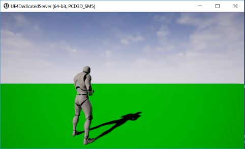
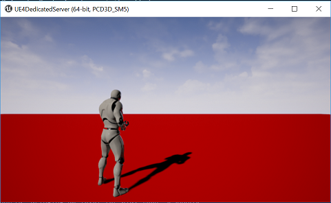

# UE4DedicatedServer

* 使用アセット
  * Animation Starter Pack
    * https://www.unrealengine.com/marketplace/animation-starter-pack
  
* XXXX**Server**.Target.cs を作成した (基本 XXXX**Editor**.Target.cs をコピーして作成)
  * Visual Studio を開いてコンフィギュレーションを Development Server にしてビルド
    * Binaries/Win64/XXXXServer.exe へ実行ファイルが作成される

* パッケージ化
  * File - Package Project - Package Settings でパッケージ化の設定
    * とりあえず以下にチェックを入れた
      * FullRebuild
      * Include Prerequisties
      * Create compressed coocked packages
  * File - Package Project - Windows - Windows (64bit) - 出力先ディレクトリを指定して出力
    * ここでは Package ディレクトリを作成して指定した

* 実行ファイルを**パッケージ化先ディレクトリ**へコピーする
  * ここでは CopyDedicatedServer.bat を作成したので、これを実行

* サーバとクライアントを起動する
  * ここでは ExecuteDedicatedServerAndClient.bat を作成したので、これを実行
  * クライアントのコンソール(@)から `open 127.0.0.1`
    * サーバに入れたら(地面が赤いマップへ移動したら)成功
    

